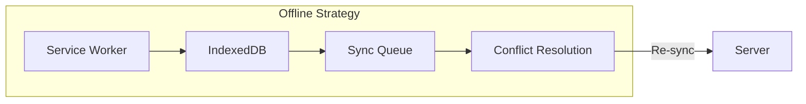

# Architecture Review - Store Inventory Management System

## Potential Issues & Recommendations

### 1. Database Schema Issues

| Issue | Severity | Recommendation |
|-------|----------|----------------|
| Inventory table may cause contention | Medium | Consider partitioning by store or using event sourcing for high-volume updates |
| Missing product variants | Medium | Add `PRODUCT_VARIANTS` table for size/color variants |
| No soft delete on critical tables | Low | Add `deleted_at` timestamp for audit compliance |
| Location hierarchy incomplete | Low | Add depth/level for nested locations beyond aisle/shelf/bin |

### 2. API Design Concerns

| Concern | Severity | Recommendation |
|---------|----------|----------------|
| Single endpoint for all operations | Medium | Split inventory operations into separate routes for better middleware handling |
| No pagination on all list endpoints | Medium | Add limit/offset to all list endpoints to prevent large payloads |
| Batch operations missing | Medium | Add `/api/inventory/batch` for bulk updates |
| No optimistic locking | Low | Add version column to prevent concurrent update conflicts |

### 3. Technology Decisions to Reconsider

| Current Choice | Alternative | Reasoning |
|----------------|-------------|-----------|
| PostgreSQL | Consider TimescaleDB | If time-series analytics become important |
| JWT only | Add session tokens | Better for security-sensitive operations |
| REST only | Add GraphQL | If frontend needs flexible queries |
| Redis for cache | Add Redis Streams | For more robust message queuing |

### 4. Missing Features Identified

| Feature | Priority | Notes |
|---------|----------|-------|
| Barcode label printing | Medium | Need to generate printable barcode labels |
| Expiry date tracking | Medium | Critical for perishable goods |
| Serial number tracking | Medium | For electronics/warranty items |
| Multi-currency support | Low | If suppliers in different countries |
| Tax handling | Low | For different tax jurisdictions |
| Gift cards/store credit | Low | Future consideration |

### 5. Security Considerations

| Item | Status | Notes |
|------|--------|-------|
| Rate limiting | Need implementation | Prevent abuse |
| IP whitelist | Optional | For additional security |
| Two-factor authentication | Consider | For admin accounts |
| API versioning | Need strategy | v1/v2 for backward compatibility |
| Data encryption at rest | Consider | For sensitive data |

### 6. Performance Concerns

| Area | Concern | Solution |
|------|---------|----------|
| Barcode lookup | Sequential scan | Add index on barcode |
| Real-time updates | Broadcast storm | Use rooms/channels per store |
| Large exports | Memory issues | Stream CSV generation |
| Image storage | Bandwidth | Use CDN with lazy loading |

### 7. Offline Mode Architecture

The current spec mentions offline mode but doesn't detail the approach:

**Recommendation:** Use Workbox for PWA caching and create a sync queue in IndexedDB for offline operations.

### 8. Scalability Considerations

| Current | Scale Limit | Upgrade Path |
|---------|--------------|---------------|
| Single PostgreSQL | 10K products | Read replicas |
| Single API server | 100 concurrent | Horizontal scaling |
| In-memory sessions | Single server | Redis sessions |
| Local file storage | Single server | S3/Cloud storage |

### 9. Testing Strategy (Missing)

The spec should include:

- Unit tests for services
- Integration tests for API
- E2E tests for critical flows
- Load testing for API
- Mobile device testing

### 10. CI/CD Pipeline (Missing)

Should include:

- Linting and formatting
- Type checking
- Unit test execution
- Build verification
- Staging deployment
- Production deployment

---

## Summary of Recommended Changes

### Must Fix Before Implementation:
1. Add batch operations endpoint for bulk inventory updates
2. Implement proper pagination on all list endpoints
3. Add indexes for barcode, SKU lookups
4. Implement rate limiting

### Should Consider:
1. Add product variants table for size/color options
2. Add expiry date tracking for perishables
3. Implement proper offline sync strategy
4. Add 2FA for admin accounts

### Nice to Have:
1. GraphQL for flexible frontend queries
2. Multi-currency support
3. Gift card integration

---

## Overall Assessment

The architecture is solid for a medium-scale retail inventory system. The main areas to focus on are:

1. **Offline mode** - Need more detailed specification
2. **Performance at scale** - Add indexing and caching strategy
3. **Batch operations** - Critical for practical usage
4. **Testing strategy** - Essential for maintainability

The technology choices are appropriate and well-suited for the requirements. The database schema is comprehensive and covers most use cases.
