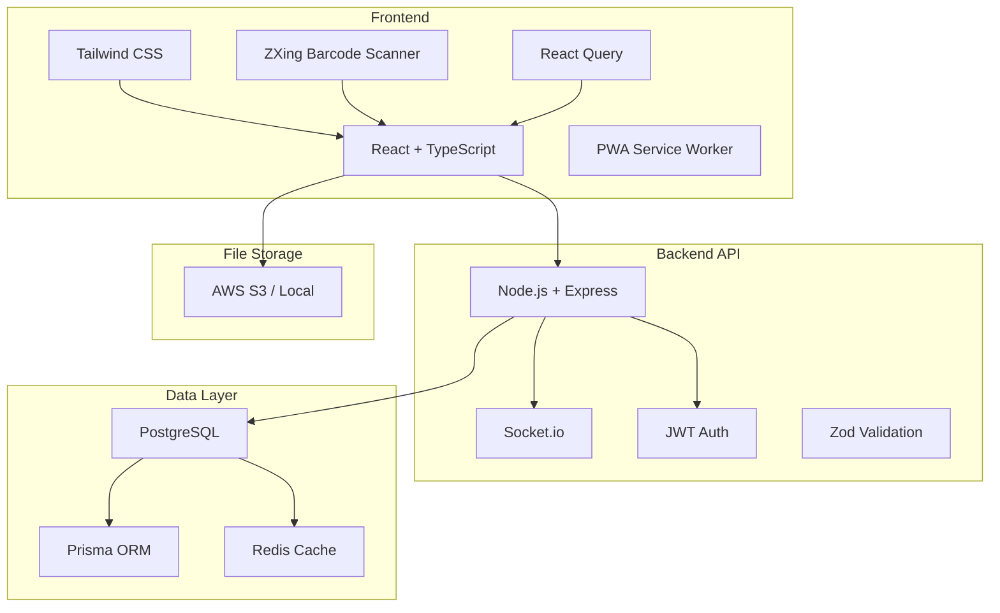
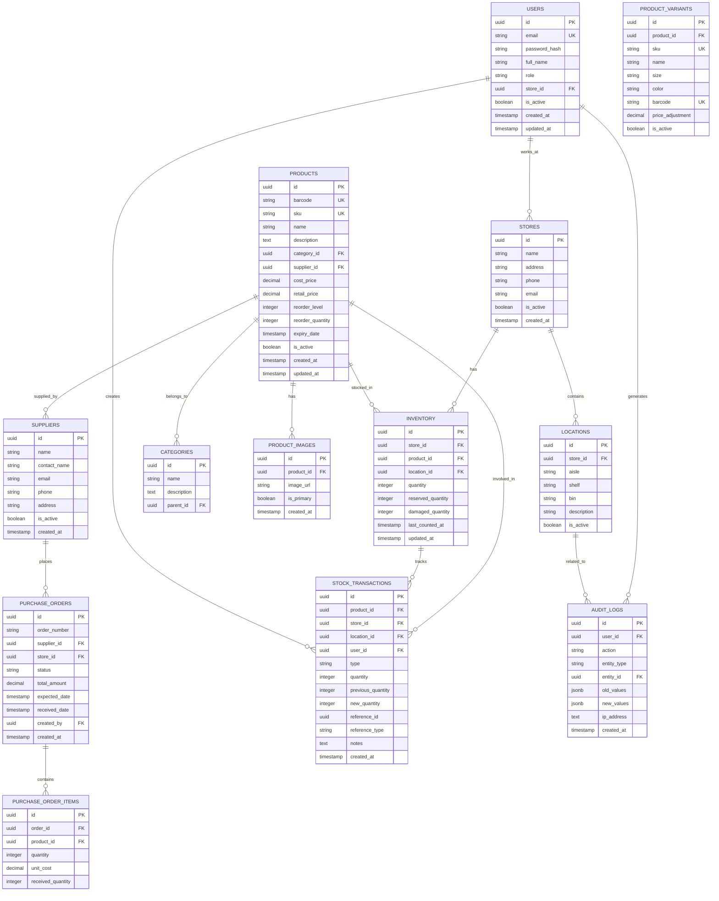
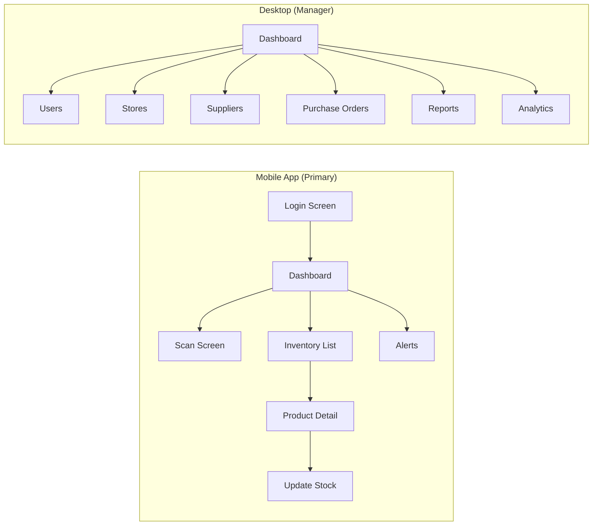

# Store Inventory Management System - Technical Specification

## 1. Project Overview

**Project Name:** StoreStock - Retail Inventory Management System

**Project Type:** Full-stack web application with mobile-first responsive design

**Core Functionality:** A comprehensive inventory management system for retail stores that enables employees to scan barcodes, track stock in real-time, manage products, suppliers, and orders, across multiple store locations with advanced analytics.

**Target Users:**
- Store employees
- Store managers
- System administrators

---

## 2. Requirements Analysis

### 2.1 Core Features

| Feature | Priority | Description |
|---------|----------|-------------|
| Barcode Scanning | High | Scan product barcodes using phone camera or barcode scanner |
| Add New Products | High | Create and manage product catalog |
| Track Quantity | High | Real-time quantity on hand tracking |
| Location Tracking | High | Track products by aisle, shelf, bin |
| Cost & Price | High | Track cost and retail price per product |
| Supplier Management | High | Manage supplier information and contacts |
| Purchase Orders | High | Create and track purchase orders |
| Sales Deductions | High | Automatic stock deduction from sales |
| Low-Stock Alerts | High | Automatic notifications for low inventory |
| Cycle Counts | High | Inventory audit and cycle counting |
| Audit History | High | Complete history of all inventory changes |
| Multi-User | High | Multiple users with role-based access |

### 2.2 Advanced Features

| Feature | Priority | Description |
|---------|----------|-------------|
| Mobile Interface | High | Phone-friendly responsive web interface |
| Offline Mode | Medium | Work offline with sync capability |
| AI Recognition | Medium | AI-powered product identification via camera |
| Predictive Restocking | Medium | AI suggestions for restocking |
| Auto Reorder | Medium | Automatic reorder generation |
| Analytics Dashboard | Medium | Sales and inventory analytics |
| POS Integration | Medium | Connect with point-of-sale systems |
| Scanner Integration | Medium | Support hardware barcode scanners |
| CSV/Excel Import | Medium | Bulk import/export functionality |
| Role Permissions | High | Granular role-based access control |
| Product Images | Medium | Image storage for products |

### 2.3 Inventory Operations

| Operation | Description |
|-----------|-------------|
| Stock In | Add inventory (receiving) |
| Stock Out | Remove inventory (sales, damaged) |
| Transfer | Move between locations |
| Adjustments | Manual count adjustments |
| Returns | Customer returns to inventory |
| Damaged | Track damaged items separately |

### 2.4 Search & Filtering

- Search by name, SKU, or barcode
- Filter by category
- Filter by supplier
- Filter by stock level (low, normal, overstocked)

---

## 3. Technology Stack

### 3.1 Recommended Stack



### 3.2 Technology Choices

| Layer | Technology | Justification |
|-------|------------|----------------|
| Frontend | React + TypeScript | Type safety, component reusability |
| Mobile | PWA with offline support | Works on phones without installation |
| Styling | Tailwind CSS | Mobile-first responsive design |
| Barcode | ZXing.js / react-qr-reader | Robust phone camera scanning |
| Backend | Node.js + Express | JavaScript full-stack |
| Real-time | Socket.io | Live inventory updates |
| Database | PostgreSQL | ACID compliance, complex queries |
| ORM | Prisma | Type-safe database access |
| Cache | Redis | Fast reads, session management |
| Auth | JWT | Stateless, scalable authentication |
| Validation | Zod | Runtime type validation |
| Testing | Jest + React Testing Library | Comprehensive testing |

---

## 4. Database Schema

### 4.1 Entity Relationship Diagram



### 4.2 Key Tables Description

| Table | Purpose |
|-------|---------|
| USERS | Employees with role-based access |
| STORES | Multiple store locations |
| LOCATIONS | Aisle/shelf/bin within stores |
| PRODUCTS | Product catalog with pricing |
| PRODUCT_IMAGES | Product images |
| CATEGORIES | Product categorization |
| SUPPLIERS | Supplier management |
| INVENTORY | Current stock levels per location |
| PURCHASE_ORDERS | Supplier orders |
| PURCHASE_ORDER_ITEMS | Items in purchase orders |
| STOCK_TRANSACTIONS | All inventory movements |
| AUDIT_LOGS | Complete audit trail |

---

## 5. API Architecture

### 5.1 REST API Endpoints

**Note:** All list endpoints support pagination with `?page=1&limit=20` query parameters.

```
Common Query Parameters:
  page     - Page number (default: 1)
  limit    - Items per page (default: 20, max: 100)
  search   - Search term
  sort     - Sort field (e.g., "name:asc", "createdAt:desc")
  filter   - JSON filter object
```

```
Authentication
POST   /api/auth/login          - User login
POST   /api/auth/logout         - User logout
POST   /api/auth/refresh        - Refresh token
GET    /api/auth/me             - Get current user

Users (Admin)
GET    /api/users               - List users
POST   /api/users               - Create user
GET    /api/users/:id           - Get user
PUT    /api/users/:id           - Update user
DELETE /api/users/:id           - Deactivate user

Stores
GET    /api/stores              - List stores
POST   /api/stores              - Create store
GET    /api/stores/:id          - Get store
PUT    /api/stores/:id          - Update store

Locations
GET    /api/locations           - List locations
POST   /api/locations           - Create location
GET    /api/locations/:id       - Get location
PUT    /api/locations/:id       - Update location

Products
GET    /api/products            - List products
POST   /api/products            - Create product
GET    /api/products/:id        - Get product
PUT    /api/products/:id        - Update product
GET    /api/products/barcode/:code - Lookup by barcode
DELETE /api/products/:id        - Deactivate product
POST   /api/products/import     - CSV import
GET    /api/products/export     - CSV export

Categories
GET    /api/categories          - List categories
POST   /api/categories          - Create category

Suppliers
GET    /api/suppliers           - List suppliers
POST   /api/suppliers           - Create supplier
GET    /api/suppliers/:id       - Get supplier
PUT    /api/suppliers/:id       - Update supplier

Inventory
GET    /api/inventory           - List inventory
GET    /api/inventory/:id       - Get inventory item
PUT    /api/inventory/:id       - Update quantity
POST   /api/inventory/scan     - Scan and update
GET    /api/inventory/low-stock - Get low stock items
GET    /api/inventory/alerts    - Get all alerts

Inventory Operations
POST   /api/inventory/stock-in     - Stock in (receive)
POST   /api/inventory/stock-out    - Stock out (sale/damaged)
POST   /api/inventory/transfer     - Transfer between locations
POST   /api/inventory/adjust      - Manual adjustment
POST   /api/inventory/returns     - Process returns
POST   /api/inventory/batch       - Batch update (bulk operations)

Cycle Counts
GET    /api/cycle-counts        - List cycle counts
POST   /api/cycle-counts        - Start cycle count
PUT    /api/cycle-counts/:id    - Update cycle count
POST   /api/cycle-counts/:id/complete - Complete cycle count

Purchase Orders
GET    /api/purchase-orders     - List purchase orders
POST   /api/purchase-orders      - Create purchase order
GET    /api/purchase-orders/:id  - Get purchase order
PUT    /api/purchase-orders/:id - Update purchase order
POST   /api/purchase-orders/:id/receive - Receive order

Transactions
GET    /api/transactions        - List transactions
GET    /api/transactions/:id    - Get transaction

Reports
GET    /api/reports/stock-levels     - Stock levels report
GET    /api/reports/movement         - Stock movement report
GET    /api/reports/by-store         - Report by store
GET    /api/reports/by-supplier      - Report by supplier
GET    /api/reports/valuation        - Inventory valuation
GET    /api/reports/low-stock        - Low stock report
GET    /api/reports/audit-trail      - Audit log report

Analytics
GET    /api/analytics/sales         - Sales analytics
GET    /api/analytics/trends         - Stock trends
GET    /api/analytics/forecasting   - Demand forecasting
```

### 5.2 WebSocket Events

```javascript
// Server -> Client events
'inventory:updated'     // When inventory changes
'stock:low'             // Low stock alert
'order:status'          // Purchase order status change
'cycle-count:updated'  // Cycle count updates
'alert:new'             // New alert notification

// Client -> Server events
'inventory:subscribe'   // Subscribe to store updates
'inventory:unsubscribe' // Unsubscribe from updates
```

---

## 6. UI/UX Design

### 6.1 Application Structure



### 6.2 Mobile-First Screens

| Screen | Components | Features |
|--------|------------|----------|
| Login | Email, Password, Submit | JWT auth |
| Dashboard | Stats cards, Quick actions, Alerts | Summary view |
| Scan | Camera view, Manual entry | Barcode/QR scanning |
| Inventory List | Search, Filters, List view | Sortable, paginated |
| Product Detail | Image, Details, Stock levels | Edit stock |
| Update Stock | +/- buttons, Quantity input, Notes | Quick update |
| Alerts | Low stock, Reorder alerts | Action buttons |

### 6.3 Desktop Screens

| Screen | Description |
|--------|-------------|
| Dashboard | Overview with charts and key metrics |
| Products | Full CRUD with bulk operations |
| Inventory | Grid view with all locations |
| Suppliers | Supplier management |
| Purchase Orders | Order creation and tracking |
| Cycle Counts | Audit scheduling and execution |
| Reports | Exportable reports |
| Analytics | Charts and visualizations |
| Users | User management |
| Settings | System configuration |

### 6.4 Component Library

- **Buttons:** Primary, Secondary, Danger, Icon buttons
- **Inputs:** Text, Number, Search with barcode icon
- **Cards:** Product card, Stats card, Alert card
- **Lists:** Inventory list, Search results
- **Modals:** Confirmation, Product quick view
- **Scanner:** Camera overlay, Scan result toast
- **Tables:** Sortable, filterable for desktop
- **Forms:** Product form, Supplier form
- **Charts:** Line, Bar, Pie charts

### 6.5 Responsive Breakpoints

| Breakpoint | Width | Target |
|------------|-------|--------|
| sm | 640px | Large phones |
| md | 768px | Tablets |
| lg | 1024px | Small laptops |
| xl | 1280px | Desktops |

---

## 7. Security Architecture

### 7.1 User Roles & Permissions

| Role | Permissions |
|------|-------------|
| Admin | Full system access, user management |
| Manager | All inventory operations, reports, suppliers |
| Employee | Scan, view inventory, update stock |
| Viewer | Read-only access to reports |

### 2. Security Measures

| Measure | Implementation |
|---------|----------------|
| Password Hashing | bcrypt with salt rounds |
| Token Auth | JWT with short expiry (15 min access, 7 day refresh) |
| Refresh Tokens | Long-lived, stored securely, rotation enabled |
| Role-based Access | Middleware permission checks |
| API Rate Limiting | 100 req/min per user (burst: 20) |
| Input Validation | Zod schema validation |
| SQL Injection | Prisma parameterized queries |
| CORS | Whitelist allowed origins |
| Audit Logging | All sensitive actions logged |
| 2FA (Admin) | Optional TOTP for admin accounts |

---

## 8. Project Structure

```
inventory/
├── client/                     # React frontend
│   ├── public/
│   │   ├── manifest.json       # PWA manifest
│   │   └── sw.js               # Service worker
│   ├── src/
│   │   ├── components/         # Reusable components
│   │   │   ├── common/         # Buttons, inputs, etc.
│   │   │   ├── layout/         # Header, sidebar, etc.
│   │   │   ├── inventory/      # Inventory-specific
│   │   │   ├── products/        # Product components
│   │   │   └── scanner/        # Barcode scanner
│   │   ├── pages/              # Page components
│   │   ├── hooks/              # Custom React hooks
│   │   ├── services/           # API services
│   │   ├── store/              # State management
│   │   ├── types/              # TypeScript types
│   │   ├── utils/              # Utility functions
│   │   ├── App.tsx
│   │   └── main.tsx
│   ├── package.json
│   ├── tailwind.config.js
│   └── vite.config.ts
│
├── server/                     # Node.js backend
│   ├── src/
│   │   ├── controllers/       # Route controllers
│   │   ├── middleware/         # Express middleware
│   │   ├── routes/            # API routes
│   │   ├── services/          # Business logic
│   │   ├── utils/             # Utility functions
│   │   ├── types/             # TypeScript types
│   │   ├── socket/            # Socket.io handlers
│   │   ├── validations/       # Zod schemas
│   │   └── index.ts           # Entry point
│   ├── prisma/
│   │   └── schema.prisma      # Database schema
│   ├── package.json
│   └── tsconfig.json
│
└── SPEC.md                     # This specification
```

---

## 9. Implementation Phases

### Phase 1: Foundation (Week 1-2)
- [ ] Project setup with React + Node.js
- [ ] Database schema implementation
- [ ] Basic authentication
- [ ] CRUD for products, suppliers, categories

### Phase 2: Core Inventory (Week 3-4)
- [ ] Inventory management (stock in/out)
- [ ] Barcode scanning integration
- [ ] Location tracking
- [ ] Real-time updates

### Phase 3: Advanced Features (Week 5-6)
- [ ] Purchase orders
- [ ] Cycle counts
- [ ] Audit logging
- [ ] Low stock alerts

### Phase 4: Reports & Analytics (Week 7-8)
- [ ] Reports generation
- [ ] Analytics dashboard
- [ ] CSV import/export

### Phase 5: Polish (Week 9-10)
- [ ] PWA optimization
- [ ] Offline mode
- [ ] Performance tuning
- [ ] Security audit
- [ ] Documentation

---

## 10. API Response Examples

### Product Response
```json
{
  "id": "uuid",
  "barcode": "1234567890123",
  "sku": "PRD-001",
  "name": "Product Name",
  "description": "Product description",
  "category": { "id": "uuid", "name": "Category" },
  "supplier": { "id": "uuid", "name": "Supplier" },
  "costPrice": 10.00,
  "retailPrice": 19.99,
  "reorderLevel": 10,
  "imageUrl": "https://...",
  "createdAt": "2024-01-01T00:00:00Z"
}
```

### Inventory Response
```json
{
  "id": "uuid",
  "store": { "id": "uuid", "name": "Store 1" },
  "product": { "id": "uuid", "name": "Product", "sku": "..." },
  "location": { "aisle": "A", "shelf": "1", "bin": "top" },
  "quantity": 50,
  "reservedQuantity": 5,
  "damagedQuantity": 0,
  "lastCountedAt": "2024-01-01T00:00:00Z"
}
```

### Stock Transaction Response
```json
{
  "id": "uuid",
  "product": { "id": "uuid", "name": "Product" },
  "store": { "id": "uuid", "name": "Store" },
  "location": { "aisle": "A", "shelf": "1", "bin": "top" },
  "type": "STOCK_IN",
  "quantity": 10,
  "previousQuantity": 40,
  "newQuantity": 50,
  "referenceType": "PURCHASE_ORDER",
  "referenceId": "uuid",
  "user": { "id": "uuid", "fullName": "John" },
  "notes": "Received order #12345",
  "createdAt": "2024-01-01T00:00:00Z"
}
```

---

## 11. Success Metrics

| Metric | Target |
|--------|--------|
| Scan response time | < 500ms |
| Inventory update latency | < 200ms |
| Page load time | < 3s on 3G |
| Uptime | 99.9% |

---

## 12. Future Enhancements

- **AI-powered forecasting** - Predict stock needs
- **OCR for receipts** - Quick inventory add
- **Voice commands** - Hands-free operation
- **Offline mode** - Work without internet (PWA)
- **Integration APIs** - Connect to POS systems
- **Multi-tenant** - SaaS for multiple retailers
